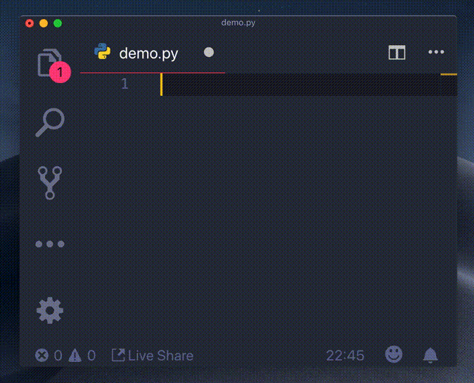

# vsc-python-indent

Correct python indentation in Visual Studio Code.

## Known Issues

This is alpha level software. Use with caution.

## Release Notes

### 0.1.0

* First pass at correct indentation.
* Preserve un-indenting behavior with `return`, `pass`, etc.
